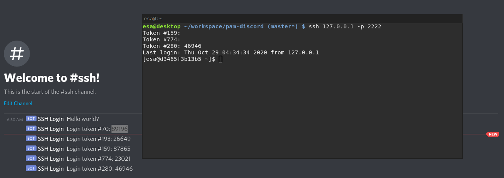

# pam-discord

A proof of concept for letting members of a discord channel authenticate to a service over SSH using single use tokens.

Compiles into a PAM-compatible library, thanks to https://github.com/anowell/pam-rs

